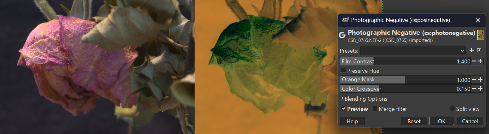

Photographic color negative implementation.

Key features:

1. __Work in perceptual__ `R~G~B~ float`

2. __Power-law contrast curve__ (`powf(1.0 - pixel, gamma)`) 
Real film has a characteristic "shoulder" and 
"toe" that compress the tonal range, preserving detail. Using `gamma < 1.0` does exactly that: it stretches the mids while 
compressing shadows and highlights in a film-like way.

3. __Orange mask__ 
C-41 color negative film has a built-in orange/amber base (the "orange mask") that compensates for dye imperfections. 
The model includes tunable mask strength for the characteristic red=0.92/green=0.58/blue=0.22 transmittance ratios.

4. __Color crossover__ 
Real film has subtle per-layer contrast variations because the three emulsion layers (cyan/magenta/yellow) have 
slightly different characteristics. The red layer gets slightly more contrast, blue slightly less, which produces natural color shifts.

Three user-adjustable properties__ (visible in GIMP's tool options panel):

- __Film Contrast__ (default 0.65): Controls the overall contrast curve. Lower values = more compressed, film-like response.
- __Orange Mask__ (default 1.0): Strength of the orange mask. 0 = no mask, 1 = typical film.
- __Color Crossover__ (default 0.15): Per-channel contrast variation. Higher = more cross-channel color shift.

-------

To build on Windows use MSYS with MINGW/GCC and MESON installed:
```
pacman -Syu
pacman --noconfirm -S base-devel mingw-w64-x86_64-toolchain mingw-w64-x86_64-meson mingw-w64-x86_64-gegl
```

Open C:\msys64\ucrt64.exe shell:

```
cd [PATH]/photonegative
meson setup builddir
ninja -C builddir

mkdir [USER]/AppData/Local/gegl-0.4/plug-ins/photonegative
cp builddir/photonegative.dll [USER]/AppData/Local/gegl-0.4/plug-ins/photonegative
```